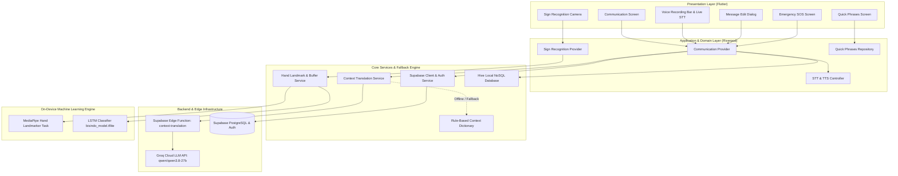

# 🇮🇩 BENTARA — Jembatan Komunikasi Inklusif Teman Tuli & Teman Dengar

<div align="center">


**Aplikasi Komunikasi Dua Arah, AI Context Translator & Penerjemah Bahasa Isyarat (BISINDO) Berbasis On-Device Machine Learning & Cloud Edge AI**  
*Dikembangkan untuk Kompetisi Mahasiswa Bidang Informatika Politeknik Nasional (KMIPN 2026)*

[](https://flutter.dev)
[](https://dart.dev)
[](https://riverpod.dev)
[](https://supabase.com)
[](https://groq.com)
[](https://www.tensorflow.org/lite)
[](https://developers.google.com/mediapipe)
[]()

</div>

---

## 📑 Daftar Isi

- [📌 Tentang BENTARA](#-tentang-bentara)
- [✨ Fitur-Fitur Unggulan](#-fitur-fitur-unggulan)
- [🏗️ Arsitektur Sistem & Alur Data](#️-arsitektur-sistem--alur-data)
- [🤖 Pipeline Machine Learning & Computer Vision](#-pipeline-machine-learning--computer-vision)
- [🔐 Arsitektur Keamanan & AI Backend](#-arsitektur-keamanan--ai-backend)
- [🛠️ Tech Stack & Dependensi](#️-tech-stack--dependensi)
- [📂 Struktur Direktori Proyek](#-struktur-direktori-proyek)
- [🚀 Panduan Instalasi & Menjalankan Aplikasi](#-panduan-instalasi--menjalankan-aplikasi)
- [⚙️ Konfigurasi Environment (`.env`)](#️-konfigurasi-environment-env)
- [☁️ Panduan Deploy Supabase Edge Function](#️-panduan-deploy-supabase-edge-function)
- [🧪 Pengujian & Validasi (Test Suite)](#-pengujian--validasi-test-suite)
- [📱 Panduan Skenario Demo (Demo Runbook)](#-panduan-skenario-demo-demo-runbook)
- [🎨 Prinsip Desain & Aksesibilitas (WCAG 2.1 AA)](#-prinsip-desain--aksesibilitas-wcag-21-aa)
- [🗺️ Roadmap Pengembangan](#️-roadmap-pengembangan)
- [👥 Kontributor & Lisensi](#-kontributor--lisensi)

---

## 📌 Tentang BENTARA

**BENTARA** adalah ekosistem aplikasi komunikasi inklusif *mobile-first* yang didesain khusus untuk meruntuhkan batas komunikasi antara **Teman Tuli** (penyandang disabilitas rungu & wicara) dan **Teman Dengar** (masyarakat umum, tenaga medis, petugas pelayanan publik, dan keluarga).

### 🔍 Latar Belakang & Masalah
1. **Barrier Bahasa Isyarat**: Lebih dari 90% masyarakat umum belum menguasai BISINDO (*Bahasa Isyarat Indonesia*), menimbulkan kecanggungan dan hambatan dalam percakapan tatap muka.
2. **Keterbatasan Konteks & Tata Bahasa**: Pesan teks yang diketik secara spontan oleh Teman Tuli kerap berstruktur ringkas/singkat (misal: *"obat pusing mana"*), yang terkadang disalahartikan kaku atau kurang formal dalam situasi profesional seperti di rumah sakit atau kantor administrasi.
3. **Ketiadaan Akses Darurat Ramah Disabilitas**: Dalam keadaan kritis, penyandang disabilitas kesulitan memanggil bantuan medis/polisi dengan cepat dan mandiri tanpa perantara.

### 💡 Solusi Holistik BENTARA
- **Komunikasi Dua Arah Real-time**: Menggabungkan *Live Speech-to-Text (STT)* dengan *Text-to-Speech (TTS)* natural.
- **AI Context Translation**: Mentransformasi teks ringkas menjadi kalimat sopan dan kontekstual secara otomatis via **Supabase Edge Functions** bertenaga **Groq Cloud LLM** (`qwen/qwen3.8-27b`), dengan proteksi fallback kamus offline.
- **Penerjemah Bahasa Isyarat BISINDO On-Device**: Deteksi gestur dua tangan (2-Hand Landmark Tracking) dengan model **TFLite LSTM** berkecepatan tinggi tanpa memerlukan koneksi internet.
- **Mode Darurat SOS Cepat**: Alarm visual berkedip kontras tinggi disertai *looping voice broadcast* dan pengeras suara otomatis.

---

## ✨ Fitur-Fitur Unggulan

### 1. 💬 Komunikasi Langsung Dua Arah (Live Two-Way Communication)
- **Voice Recording Bar Interaktif**: Visualizer audio reaktif yang mendeteksi suara ucapan Teman Dengar secara *real-time* dengan kontrol batal/kirim yang mulus.
- **Live Message Editing Flow**: Fitur koreksi dan edit pesan instan sebelum dikirim atau disuarakan kembali, memastikan teks hasil pengenalan suara benar-benar akurat.
- **Dual-Layer Context Bubble**: Bubble chat interaktif yang menampilkan teks asli masukan dan teks hasil terjemahan AI secara elegan dengan fitur *expand/collapse*, salin cepat, dan putar suara TTS.
- **Mode Peran Pengguna**: Pengalaman yang disesuaikan secara dinamis untuk mode **Teman Tuli** (fokus teks & gestur) atau **Teman Dengar** (fokus suara & mikrofon).

### 2. 🧠 AI Context Translation (Penerjemah Bahasa Kontekstual)
- **Transformasi Bahasa Kaku ke Kalimat Formal**: Menyulap teks singkat menjadi kalimat yang santun, tertata, dan sesuai dengan situasi sosial.
- **Preset Konteks Spesifik**:
  - 🏥 **Rumah Sakit / Medis**: Disesuaikan dengan etika konsultasi dokter dan terminologi kesehatan (misal: *"Maaf Dokter, di mana saya bisa mendapatkan obat untuk sakit kepala saya?"*).
  - 🏛️ **Layanan Publik**: Disesuaikan untuk urusan administrasi pemerintahan, pembuatan KTP, perbankan, dan pengaduan resmi.
  - 🚨 **Darurat**: Format kalimat bernada mendesak dan langsung pada pokok pertolongan.
  - 🌐 **Umum**: Percakapan sehari-hari yang ramah dan luwes.
- **Arsitektur Multi-Tier**: Inferensi cloud cepat via Supabase Edge Function + Groq LLM API, didukung mesin *Rule-Based Offline Dictionary* sebagai jaminan kontinuitas tanpa internet.

### 3. 🖐️ Penerjemah Isyarat BISINDO Real-Time (On-Device Computer Vision)
- **Deteksi 2-Tangan Simultan**: Melacak 21 titik pergelangan tangan & jari kiri dan kanan (total 126 fitur koordinat normal per frame).
- **Model TFLite LSTM**: Pemrosesan buffer sekuensial 30 frame secara *real-time* langsung di dalam prosesor ponsel (*zero cloud latency* & hemat kuota).
- **Kamus Kosakata BISINDO 15 Kelas**:
  `halo`, `nama`, `kamu`, `siapa`, `terimakasih`, `makan`, `tidur`, `buku`, `telepon`, `menulis`, `jam`, `pusing`, `pintar`, `jalan`, `saya`.
- **Composed Sentence Builder**: Merangkai kata demi kata yang terdeteksi menjadi kalimat utuh, siap disuarakan via TTS atau dikirimkan langsung ke ruang obrolan.

### 4. ⚡ Komunikasi Cepat (Quick Phrases)
- Frasa percakapan instan yang dikelompokkan dalam kategori: **Umum**, **Rumah Sakit / Medis**, **Layanan Publik**, **Transportasi**, **Belanja**, dan **Darurat**.
- Pencarian cerdas (*live search*), penanda frasa favorit (*star bookmarking*), penambahan frasa kustom lokal, serta tombol *One-Tap TTS* dan *Kirim ke Chat*.

### 5. 🚨 Mode Darurat (Emergency SOS)
- **Aktivasi Cepat 1-Ketuk**: Mengaktifkan layar berkedip kontras tinggi (*high-visibility strobing alert*) dan siaran suara darurat berulang (*continuous audio broadcast loop*).
- **Tombol Frasa Darurat Instan**:
  - *"SAYA BUTUH AMBULANS SEKARANG!"*
  - *"TOLONG HUBUNGI POLISI!"*
  - *"BAWA KE RUMAH SAKIT!"*
  - *"SAYA TERLUKA!"*
  - *"SAYA BUTUH BANTUAN!"*
- **Sistem Penghentian Aman**: Mencegah penonaktifan darurat yang tidak disengaja melalui dialog konfirmasi berproteksi.

### 6. 📜 Riwayat Percakapan (Conversation History & Sync)
- Penyimpanan riwayat percakapan otomatis dengan label waktu dan konteks.
- Sinkronisasi cloud Supabase Database saat online dan penyimpanan lokal *Hive NoSQL* super cepat saat offline.

### 7. 👤 Profil & Preferensi Aksesibilitas
- **Manajemen Akun & Demo Mode**: Mendukung autentikasi Supabase serta mode demo instan tanpa login.
- **Kustomisasi Aksesibilitas (WCAG Compliant)**:
  - Mode Kontras Tinggi (*High Contrast Mode*).
  - Skala Ukuran Font (*Dynamic Text Scaling 1.0x - 1.5x*).
  - Pengatur Kecepatan (*Speech Rate*) dan Nada (*Pitch*) TTS.
  - Pengatur Umpan Balik Getar (*Haptic Feedback*).
  - Pengelola & Pembersih Cache Lokal.

---

## 🏗️ Arsitektur Sistem & Alur Data

BENTARA mengimplementasikan arsitektur bersih (*Clean Architecture*) berlapis dengan pola *Feature-First* yang dipadukan bersama **Riverpod 2.5** untuk *reactive state management*:



---

## 🤖 Pipeline Machine Learning & Computer Vision

Pipeline pengenalan Bahasa Isyarat BISINDO di BENTARA dirancang khusus untuk meminimalkan latensi dengan eksekusi 100% *on-device*:

```
┌─────────────────────────┐     ┌──────────────────────────────────┐     ┌─────────────────────────────────┐
│  Camera Stream (30 FPS) │ ──► │  MediaPipe Hand Landmarker Task  │ ──► │    Hand Landmark Extractor      │
│  (Front / Back Camera)  │     │   (Left & Right Hand Tracking)   │     │  (21 Points × 3 Coords × 2 Hands) │
└─────────────────────────┘     └──────────────────────────────────┘     └────────────────┬────────────────┘
                                                                                          │ (126 raw features)
                                                                                          ▼
┌─────────────────────────┐     ┌──────────────────────────────────┐     ┌─────────────────────────────────┐
│     Output Kalimat      │ ◄── │  Classification & Stabilization  │ ◄── │      Normalization Engine       │
│  TTS Voice & Chat Sync  │     │  (Debounce & Confidence ≥ 70%)   │     │   (Wrist-Relative & Dist-Scale) │
└─────────────────────────┘     └─────────────────▲────────────────┘     └────────────────┬────────────────┘
                                                  │                                       │ (126 normalized)
                                                  │                                       ▼
                                        ┌─────────┴───────────────┐      ┌─────────────────────────────────┐
                                        │    TFLite LSTM Model    │ ◄─── │      Sliding Window Buffer      │
                                        │ (bisindo_model.tflite)  │      │     (30 Consecutive Frames)     │
                                        └─────────────────────────┘      └─────────────────────────────────┘
```

### Tahapan Pemrosesan:
1. **Perekaman Frame**: Menangkap input visual melalui `camera` pada frame rate 30+ FPS.
2. **MediaPipe Landmark Extraction**: Mendeteksi 21 sendi tangan (ruas jari & pergelangan) dalam 3 dimensi $(x, y, z)$ untuk kedua tangan.
3. **Normalisasi Ruang**: Mengubah titik koordinat relatif terhadap pergelangan tangan (*wrist-relative coordinate system*) dan menyelaraskan skala jarak agar tahan terhadap variasi jarak tubuh ke kamera.
4. **Sliding Buffer (30 Frames)**: Mengumpulkan sekuens temporal berdimensi `[1, 30, 126]`.
5. **LSTM Classification**: Mengeksekusi inferensi model TFLite `bisindo_model.tflite` untuk memprediksi probabilitas label kata.
6. **Debouncing & Confidence Filter**: Menerapkan ambang batas probabilitas $\ge 70\%$ dengan syarat kestabilan minimal 2 frame berturut-turut guna mengeliminasi *flickering* atau *false positive* saat transisi gerakan.

---

## 🔐 Arsitektur Keamanan & AI Backend

Untuk menjamin keamanan kunci API (*Zero Secret Leak on Client*), BENTARA menerapkan arsitektur serverless modern:

- **Supabase Edge Functions (`context-translation`)**: Seluruh pemanggilan ke LLM Groq Cloud dilakukan melalui fungsi Deno di tepi jaringan (*edge*).
- **Supabase Secrets**: `GROQ_API_KEY` disimpan secara terenkripsi di server Supabase, sehingga aplikasi mobile Flutter hanya membutuhkan `SUPABASE_URL` dan `SUPABASE_ANON_KEY`.
- **Proteksi Prompt Injection & Limitasi Input**: Edge Function dilengkapi validasi batas panjang karakter ($\le 500$ karakter), sanitasi tag, dan instruksi penegasan peran agar model tidak dapat dimanipulasi oleh input instruktif ilegal.
- **Fail-Safe Offline Mode**: Apabila perangkat kehilangan sinyal internet, sistem secara otomatis beralih ke *Local Context Translation Engine* tanpa memblokir pengalaman pengguna.

---

## 🛠️ Tech Stack & Dependensi

| Kategori | Teknologi / Library | Versi | Deskripsi Kegunaan |
| :--- | :--- | :--- | :--- |
| **Framework** | [Flutter](https://flutter.dev) | `SDK >= 3.3.0` | Framework lintas platform utama |
| **Language** | [Dart](https://dart.dev) & [TypeScript/Deno](https://deno.land) | `Dart >= 3.3.0` | Bahasa pemrograman aplikasi & Edge Function |
| **State Management** | `flutter_riverpod` | `^2.5.1` | Manajemen state reaktif & Dependency Injection |
| **Routing** | `go_router` | `^14.2.0` | Navigasi deklaratif dan rute terproteksi |
| **Backend as a Service** | `supabase_flutter` | `^2.5.6` | Autentikasi, Database PostgreSQL, dan Realtime sync |
| **Edge Functions** | Supabase Edge Functions (Deno) | `Deno std@0.168.0` | Serverless backend perantara Groq AI dengan enkripsi rahasia |
| **AI LLM Engine** | Groq Cloud API (`qwen/qwen3.8-27b`) | `v1` | Mesin inferensi LLM ultra-cepat (~300ms) |
| **Local NoSQL Storage** | `hive_flutter` | `^1.1.0` | Penyimpanan lokal instan untuk offline cache & preferensi |
| **On-Device ML** | `tflite_flutter` | `^0.12.1` | Runtime inferensi model LSTM BISINDO |
| **Computer Vision** | MediaPipe Hand Landmarker | `task` | Ekstraksi 21 koordinat landmark tangan |
| **Camera Access** | `camera` | `^0.10.5` | Perekaman stream kamera real-time |
| **Speech-to-Text** | `speech_to_text` | `^7.4.0` | Pengenalan suara ucapan real-time |
| **Text-to-Speech** | `flutter_tts` | `^4.0.2` | Sintesis ucapan suara natural multi-nada |
| **Environment Config** | `flutter_dotenv` | `^5.1.0` | Pemuat variabel environment lokal |
| **Vector Graphics** | `flutter_svg` | `^2.0.10+1` | Rendering ikon dan aset SVG |

---

## 📂 Struktur Direktori Proyek

```
bentara/
├── android/                         # Konfigurasi native platform Android
├── assets/                          # Aset statis aplikasi
│   ├── button/                      # Asset tombol interaktif
│   ├── images/                      # Ilustrasi dan artwork UI
│   ├── logos/                       # Logo identitas resmi BENTARA
│   └── models/                      # Model Machine Learning & Vocabulary
│       ├── bisindo_model.tflite     # Model klasifikasi TFLite LSTM BISINDO
│       ├── hand_landmarker.task     # Model MediaPipe Hand Landmarks
│       └── label_map.json           # Pemetaan label 15 kata BISINDO
├── ios/                             # Konfigurasi native platform iOS
├── lib/
│   ├── core/                        # Modul fondasi & utilitas global
│   │   ├── constants/               # Konstanta kunci & konfigurasi env
│   │   ├── errors/                  # Penanganan error & exception
│   │   ├── router/                  # Definisi rute GoRouter (AppRouter)
│   │   ├── services/                # Layanan Supabase & Hive
│   │   ├── theme/                   # Tema warna, tipografi & dimensi
│   │   └── utils/                   # Helper sanitasi teks, format, audio
│   ├── features/                    # Modul fitur berbasis Clean Architecture
│   │   ├── auth/                    # Login, Register, Forgot Password & Demo Mode
│   │   ├── communication/           # Live STT/TTS, AI Translator, Bubble, & Edit Flow
│   │   │   ├── models/              # Model data pesan & preset konteks
│   │   │   ├── presentation/        # Layar chat, VoiceRecordingBar & EditDialog
│   │   │   ├── providers/           # State notifier Riverpod untuk komunikasi
│   │   │   └── services/            # Context translation & STT/TTS service
│   │   ├── emergency/               # Mode Darurat SOS, Strobing UI & Audio Looper
│   │   ├── history/                 # Riwayat percakapan & pencarian sesi
│   │   ├── home/                    # Dashboard beranda utama
│   │   ├── onboarding/              # Walkthrough panduan pengguna baru
│   │   ├── profile/                 # Profil pengguna, statistik & ganti peran
│   │   ├── quick_communication/     # Katalog frasa cepat & bookmark
│   │   ├── settings/                # Pengaturan aksesibilitas & suara
│   │   ├── sign_recognition/        # Deteksi BISINDO kamera & sentence builder
│   │   └── splash/                  # Layar inisialisasi & splash screen
│   ├── shared/                      # Widget UI pakai ulang (Buttons, Cards, Modals)
│   └── main.dart                    # Entry point aplikasi Flutter
├── supabase/                        # Konfigurasi Supabase Backend & Functions
│   ├── functions/
│   │   └── context-translation/     # Deno Edge Function untuk Groq LLM Translation
│   │       └── index.ts
│   └── config.toml                  # Konfigurasi lokal Supabase CLI
├── test/                            # Unit test, widget test & responsive test suite
├── .env.example                     # Template variabel environment
├── pubspec.yaml                     # Manifest paket dan dependensi Flutter
└── README.md                        # Dokumentasi komprehensif proyek
```

---

## 🚀 Panduan Instalasi & Menjalankan Aplikasi

### 1. Prasyarat Sistem
- **Flutter SDK**: Versi `^3.3.0` atau terbaru ([Panduan Instalasi Flutter](https://docs.flutter.dev/get-started/install)).
- **Dart SDK**: Versi `^3.3.0` (terintegrasi dengan Flutter SDK).
- **JDK**: OpenJDK 17 atau yang lebih baru.
- **Android Studio / VS Code** dengan ekstensi Flutter & Dart terpasang.
- **Smartphone Fisik Android** (Sangat disarankan) dengan kamera dan mikrofon aktif untuk pengujian STT dan kamera BISINDO secara optimal.

### 2. Kloning Repositori
```bash
git clone https://github.com/Fahmisanzz/Bentara.git
cd Bentara
```

### 3. Instalasi Dependensi
```bash
flutter pub get
```

### 4. Konfigurasi Environment (`.env`)
Salin template `.env.example` ke file `.env` pada direktori root:
```bash
cp .env.example .env
```
Buka file `.env` dan masukkan kredensial Supabase Anda:
```env
SUPABASE_URL=https://your-supabase-project.supabase.co
SUPABASE_ANON_KEY=your-supabase-anon-key
```

### 5. Menjalankan Aplikasi
Hubungkan perangkat Android Anda melalui kabel USB (aktifkan USB Debugging) atau gunakan emulator:
```bash
# Menjalankan dalam mode Debug
flutter run

# Menjalankan dalam mode Release (Direkomendasikan untuk performa optimal kamera & AI)
flutter run --release
```

---

## ⚙️ Konfigurasi Environment (`.env`)

| Variabel | Deskripsi | Status | Keterangan |
| :--- | :--- | :---: | :--- |
| `SUPABASE_URL` | URL endpoint proyek Supabase | **Wajib** | Ditemukan di Dashboard Supabase -> *Project Settings* -> *API*. |
| `SUPABASE_ANON_KEY` | Public Anon API Key Supabase | **Wajib** | Ditemukan di Dashboard Supabase -> *Project Settings* -> *API*. |

> 🔒 **Pemberitahuan Keamanan**: `GROQ_API_KEY` tidak lagi diletakkan di file `.env` aplikasi client, melainkan disimpan sebagai **Supabase Secret** di backend Edge Functions untuk mencegah kebocoran kunci API.

---

## ☁️ Panduan Deploy Supabase Edge Function

Jika Anda mengelola backend Supabase sendiri, deploy Edge Function `context-translation` dengan langkah berikut:

1. **Pasang Supabase CLI**:
   ```bash
   npm install -g supabase
   ```
2. **Login ke Akun Supabase**:
   ```bash
   supabase login
   ```
3. **Hubungkan Proyek**:
   ```bash
   supabase link --project-ref your-project-id
   ```
4. **Atur Secret Kunci API Groq**:
   ```bash
   supabase secrets set GROQ_API_KEY=gsk_your_groq_api_key_here
   ```
5. **Deploy Fungsi**:
   ```bash
   supabase functions deploy context-translation --no-verify-jwt
   ```

---

## 🧪 Pengujian & Validasi (Test Suite)

Proyek BENTARA dilengkapi dengan rangkaian pengujian komprehensif yang mencakup pengujian unit, pengujian widget interaktif, dan pengujian responsivitas:

```bash
# Menjalankan seluruh test suite
flutter test

# Menjalankan uji alur perekaman suara (Voice Recording Bar)
flutter test test/features/communication/voice_recording_flow_test.dart

# Menjalankan uji dialog edit pesan (Message Edit Flow)
flutter test test/features/communication/message_edit_test.dart

# Menjalankan uji bubble terjemahan konteks
flutter test test/features/communication/context_message_bubble_test.dart

# Menjalankan uji logika penerjemahan konteks AI & offline fallback
flutter test test/features/communication/context_translation_test.dart

# Menjalankan uji responsivitas layout antar berbagai ukuran layar
flutter test test/core/responsive_screens_test.dart
```

---

## 📱 Panduan Skenario Demo (Demo Runbook)

### 🎬 Skenario 1: Komunikasi Dua Arah & Live Audio Recording
1. Buka menu **"Komunikasi Langsung"**.
2. **Teman Dengar**: Tekan tombol **Mikrofon** di bagian bawah. Bar perekaman suara interaktif akan muncul.
3. Ucapkan kalimat:  
   *"Halo, selamat pagi. Ada yang bisa saya bantu hari ini?"*
4. Teks hasil STT akan langsung tertampil di layar Teman Tuli.
5. **Teman Tuli**: Balas dengan mengetik atau memilih frasa cepat, lalu tekan **Kirim**.
6. Tekan tombol **Speaker (TTS)** pada bubble chat untuk memperdengarkan suara balasan kepada Teman Dengar.

### 🎬 Skenario 2: AI Context Translation & Live Edit
1. Pada menu Komunikasi Langsung, aktifkan **AI Context Translation** (pilih preset **"Rumah Sakit"**).
2. Ketik teks singkat/kasar: *"obat pusing mana"*.
3. Tekan **Kirim**. AI Context Engine secara otomatis mengubah pesan menjadi:  
   *"Maaf Dokter, di mana saya bisa mendapatkan obat untuk sakit kepala saya?"*.
4. Klik tombol **Edit (Pensil)** pada bubble chat untuk membuka dialog edit jika ingin menyesuaikan kata sebelum dibacakan oleh TTS.

### 🎬 Skenario 3: Deteksi Bahasa Isyarat BISINDO (On-Device ML)
1. Dari dashboard Beranda, buka **"Penerjemah Isyarat"**.
2. Arahkan kamera depan/belakang ke kedua tangan Anda.
3. Lakukan gerakan isyarat BISINDO (contoh: gestur *halo*, *saya*, *terimakasih*).
4. Indikator akurasi akan menampilkan label kata yang terdeteksi ($\ge 70\%$).
5. Rangkaian kata akan tersusun di bilah *Sentence Builder*.
6. Tekan tombol **"Ucapkan"** untuk memperdengarkan suara, atau tombol **"Kirim ke Obrolan"** untuk membawanya langsung ke ruang chat.

### 🎬 Skenario 4: Mode Darurat SOS
1. Tekan tombol darurat merah menyala **"MODE DARURAT"** di Beranda.
2. Pilih kartu darurat: *"SAYA BUTUH AMBULANS SEKARANG!"*.
3. Layar ponsel akan berkedip merah terang dan suara peringatan darurat akan disiarkan secara terus-menerus.
4. Tekan tombol **"Hentikan Siaran"** dan konfirmasi untuk menonaktifkan mode darurat dengan aman.

---

## 🎨 Prinsip Desain & Aksesibilitas (WCAG 2.1 AA)

Aplikasi BENTARA dirancang dengan mematuhi standar aksesibilitas internasional:
- 👁️ **Kontras Visual Tinggi**: Memadukan warna biru tua (#1E3A8A) dan putih solid (#FFFFFF) yang memenuhi rasio kontras ketat WCAG AAA/AA tanpa transparansi buram yang melelahkan mata.
- 🎯 **Target Sentuh Luas**: Semua tombol memiliki dimensi sentuh minimal **$48 \times 48\text{ px}$** untuk mempermudah navigasi motorik.
- 📳 **Multimodal Feedback**: Setiap aksi penting disertai konfirmasi visual, haptic vibration, dan audio tone.
- 🔠 **Skalabilitas Teks**: Mendukung perbesaran font hingga 150% tanpa merusak tata letak antarmuka (*Dynamic Viewport Responsive*).

---

## 🗺️ Roadmap Pengembangan

- [x] **Fase 1**: Fondasi arsitektur Clean Architecture, Riverpod, STT, TTS, dan Supabase Auth.
- [x] **Fase 2**: Implementasi On-Device MediaPipe Hand Landmark & Klasifikasi BISINDO TFLite LSTM 15 kelas.
- [x] **Fase 3**: AI Context Translation via Supabase Edge Function (Groq LLM) dengan perlindungan Zero API Leak & Offline Dictionary.
- [x] **Fase 4**: Fitur Voice Recording Bar, Live Message Editing, Katalog Frasa Cepat Lengkap, dan Mode Darurat SOS Strobing.
- [x] **Fase 5**: Pengujian komprehensif (Unit, Widget, Voice Flow, Responsive Screens).
- [ ] **Fase 6 (Mendatang)**:
  - Ekspansi perbendaharaan kosakata BISINDO ke 100+ kata dan pelacakan ekspresi wajah (*Facial Emotion Tracking*).
  - Integrasi koordinat geolokasi GPS otomatis & SMS darurat ke kontak terdekat saat Mode SOS diaktifkan.
  - Integrasi notifikasi getar pada perangkat *wearable* (Smartwatch).

---

## 👥 Kontributor & Lisensi

Dikembangkan dengan dedikasi penuh untuk kemajuan inklusivitas disabilitas Indonesia oleh **Tim BENTARA** — Mahasiswa Politeknik Negeri Fakfak dalam ajang **Kompetisi Mahasiswa Bidang Informatika Politeknik Nasional (KMIPN 2026)**.

Proyek ini dirilis untuk kepentingan sosial, edukasi, dan kemanusiaan.

<div align="center">
  <sub>🇮🇩 Bersama BENTARA, Setiap Suara dan Isyarat Memiliki Arti.</sub>
</div>
